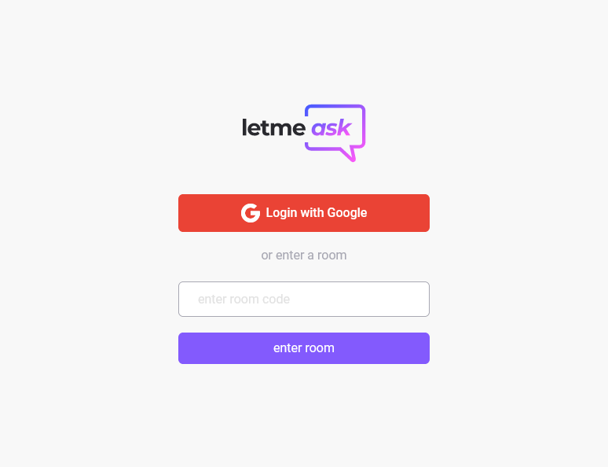
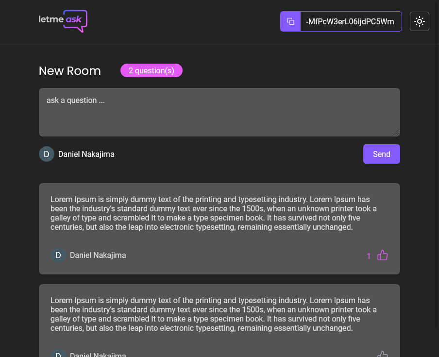

 
## LetMeAsk

 
 

 
 
## Technologies
 - ReactJs
 - Firebase
 - Tailwind CSS

## Features

 - [x] Create room and ask questions
 - [x] Answer, highlight and delete a question (admin only)
 - [x] Dark mode
 - [x] Responsive
 - [x] Delete question modal
 - [ ] PWA
 - [ ] Eslint/Prettier
 - [ ]  on room -> useEffect questions list need to update only on data added (add only the new question) and not load everything from firebase. use firebase child_added,  child_changed etc (prevent performance issue)
 - [ ]  Unity tests

